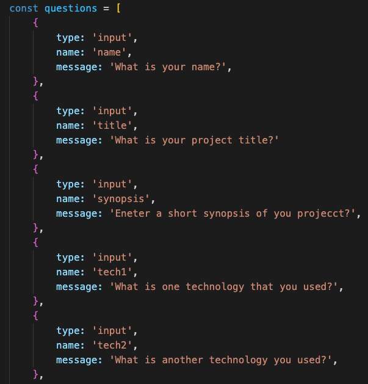
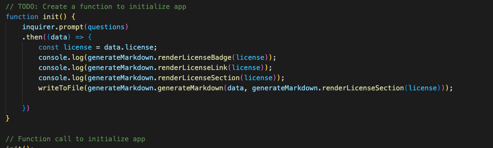
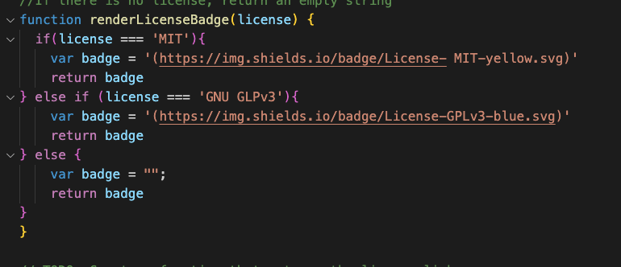
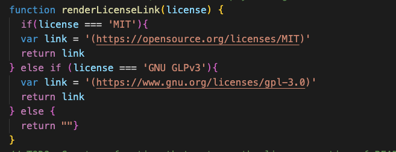
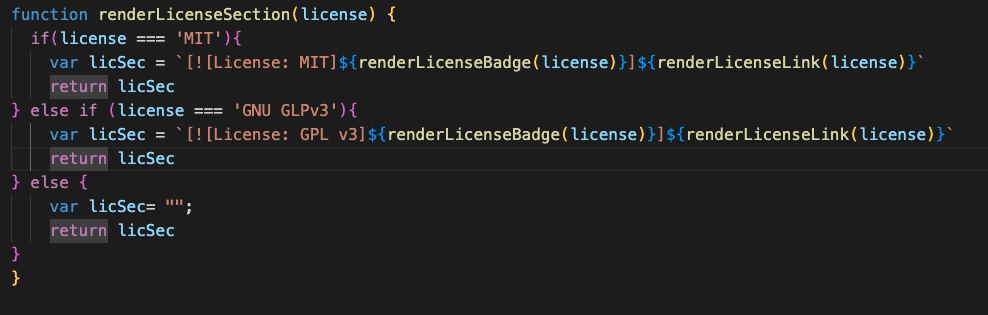
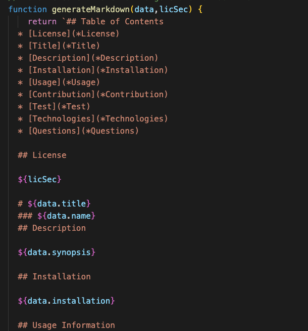
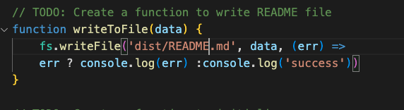

## Table of Contents
  * [License](*License)
  * [Title](*Title)
  * [Description](*Description)
  * [Installation](*Installation)
  * [Usage](*Usage)
  * [Contribution](*Contribution)
  * [Test](*Test)
  * [Technologies](*Technologies)
  * [Questions](*Questions)
  
  ## License
  
  

  # README Generator
  ### Grant Ellington
  ## Description
  This program creates a README file that can be used as a starting template for other projects.
  
  ## Installation
  To install, clone the repository and run node index.js to start the program.

  
  ## Usage Information
  
  g
  
  ## Contribution Guidlines
  
  To contribute, contact the creator in the 
  
  ## Test
  No test were used for this program, test may be set up in the future.
  
  
  ## Techonologies
  Project is created with:
  * JavaScritp
  * Node.js
  * NPM Inquirer
  
  ## Spot-Light
  
  Below is the Question array which stores the questions for inquirere prompt.

  

  Below is the init fuction which calls all the functions insluding the functions in the util folder.

  

  Below is the function whhich return the function badge image.

  

  Below is the function that returns the Liscense link based off of the inquirer prompt.

  

  Below is the function whcih creates the license section that will be added to the readme.

  

  The below function returns a template literal which will be used in the write to File function.

  

  Below is the writ to file function whcih takes the template literal and writes the file incorporating the data from the prompt.

  

  
  ## Questions
  
  [email](gellingtonem6@gmail.com)
  [GitHub](https://github.com/Grant-Ellington)